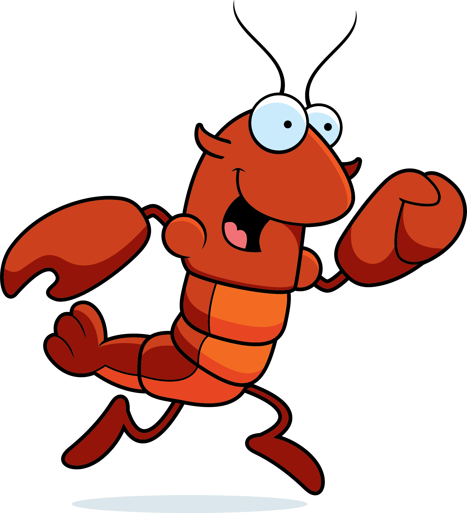

 <iframe id="iframeId" srcdoc="<h1>test</h1>
 
Hello
"     name="userIframe">                                     </iframe> 

  

    
  

  

#### Well, sometimes a nickname sticks. I did get very sunburned that day ...
  

A span

Something cool but overly long and boring, but needs to wrap onto the next line

Me

Well, sometimes a nickname sticks. I did get very sunburned that day ...

<!--  -->
<!--
**johnlobster/johnlobster** is a ✨ _special_ ✨ repository because its `README.md` (this file) appears on your GitHub profile.

Here are some ideas to get you started:

- 🔭 I’m currently working on ...
- 🌱 I’m currently learning ...
- 👯 I’m looking to collaborate on ...
- 🤔 I’m looking for help with ...
- 💬 Ask me about ...
- 📫 How to reach me: ...
- 😄 Pronouns: ...
- ⚡ Fun fact: ...
-->
